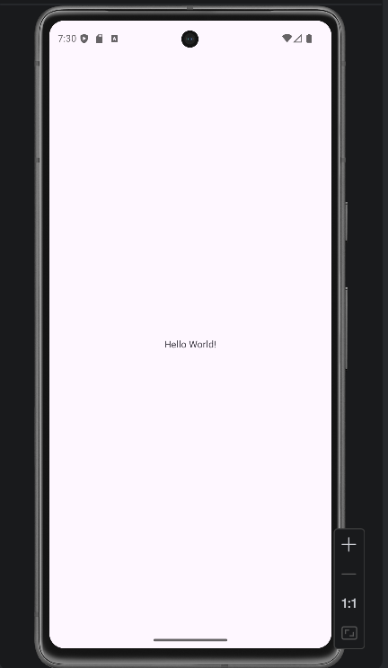
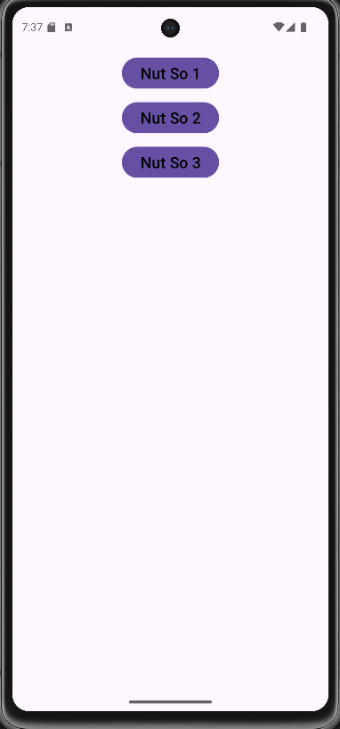
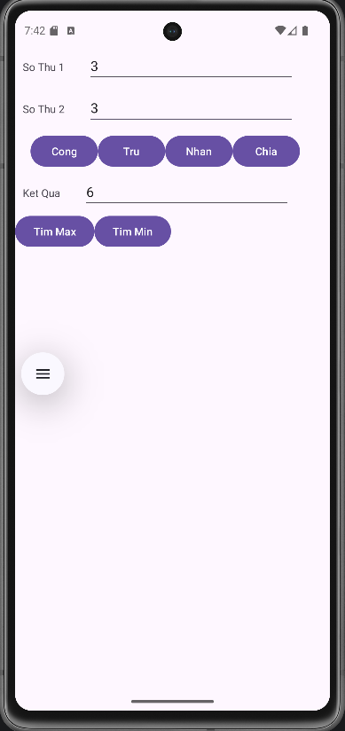
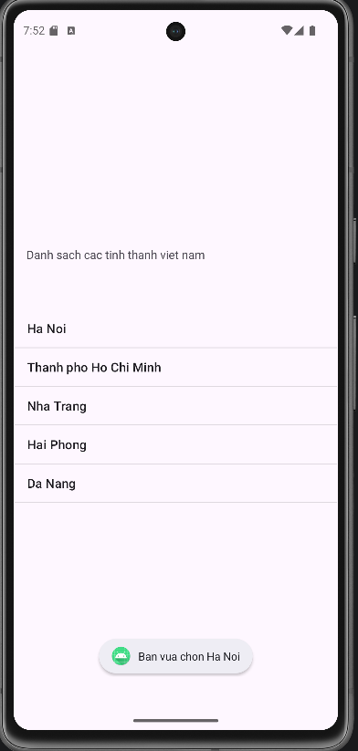
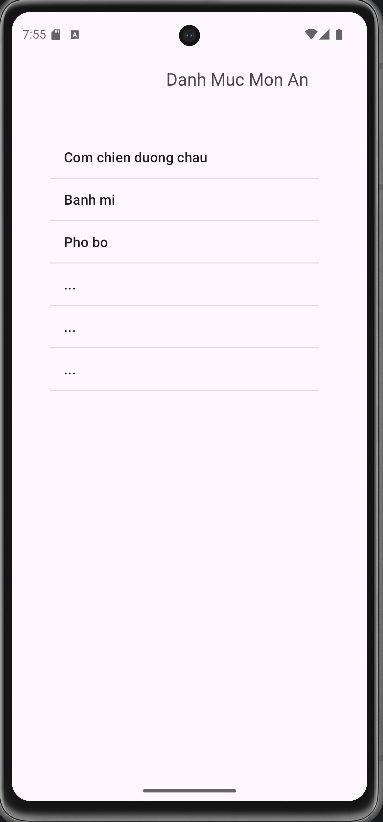
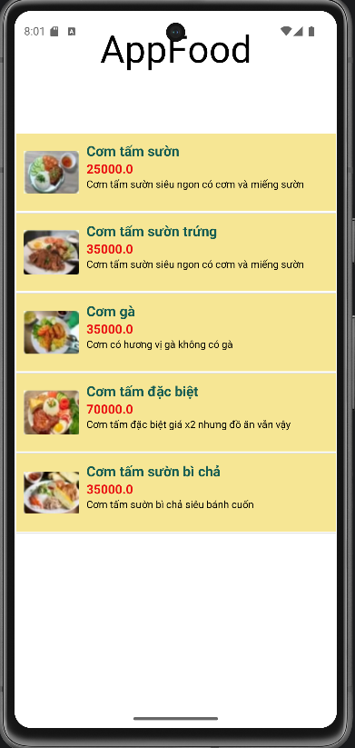
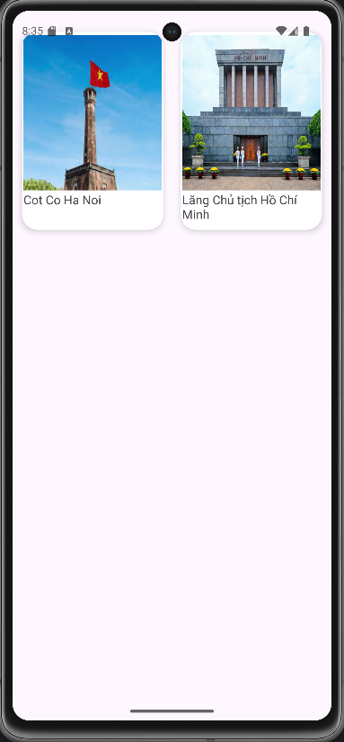

# Android Programming

## Thông tin sinh viên

* Họ tên: Bảo Võ Lê Gia
* MSSV: 65130217
* Trường: Đại học Nha Trang

---

## Giới thiệu

Repository này dùng để lưu trữ các bài tập và nội dung học tập môn **Lập trình Android**.

---

## Nội dung thực hành

### Bài tập 1: Làm quen Android Studio

* Tạo project đầu tiên
* Hello World
* [Chi tiết bài tập](https://github.com/gbao289/65130217-AndroidProgramming/blob/main/HelloWorld/app/src/main/java/com/example/helloworld/MainActivity.java)
* 
### Bài tập 2: Layout cơ bản

* LinearLayout
* ConstraintLayout
* Thiết kế giao diện đơn giản
* [Chi tiết bài tập](https://github.com/gbao289/65130217-AndroidProgramming/blob/main/BTH3_LinearLayout/app/src/main/res/layout/activity_main.xml)
* 

### Bài tập 3: Xử lý sự kiện

* Button click
* EditText input
* Toast message
* [Chi tiết bài tập](https://github.com/gbao289/65130217-AndroidProgramming/blob/main/BaiTH5_XuLySuKien/app/src/main/java/com/example/appconglinearlayout/MainActivity.java)
* 

### Bài tập 4: Ứng dụng Calculator

* Xây dựng app tính toán cơ bản
* [Chi tiết bài tập](https://github.com/gbao289/65130217-AndroidProgramming/blob/main/AppCongLinearLayout/app/src/main/java/com/example/appconglinearlayout/MainActivity.java)
* 
### Bài tập 5: ListView

* Hiển thị danh sách
* Custom Adapter
* [Chi tiết bài tập](https://github.com/gbao289/65130217-AndroidProgramming/blob/main/BaiTh7_ListView/app/src/main/java/giabao/baith7_listview/MainActivity.java)
* 
* [Chi tiết bài tập](https://github.com/gbao289/65130217-AndroidProgramming/blob/main/BaiTH7_dsmonan/app/src/main/java/bao/myapplication/MainActivity.java)
* 
* [Chi tiết bài tập](https://github.com/gbao289/65130217-AndroidProgramming/blob/main/BaiTH8_TuyChinhLV/app/src/main/java/bao/myapplication/MainActivity.java)
* 
### Bài tập 6: Recycler View

* Hiển thị danh sách
* Custom Adapter
* [Chi tiết bài tập](https://github.com/gbao289/65130217-AndroidProgramming/tree/main/BaiTH9_RecyclerView/app/src/main/java/bao/baith9_recyclerview)
* 
---

## Công nghệ sử dụng

* Java
* Android Studio
* XML

---

## Hướng dẫn chạy project

1. Clone repository:

```bash
git clone https://github.com/gbao289/65130217-AndroidProgramming.git
```

2. Mở bằng Android Studio

3. Chạy ứng dụng trên Emulator hoặc thiết bị thật

---

## Ghi chú

* Đây là repository phục vụ mục đích học tập
* Nội dung sẽ được cập nhật theo từng tuần học
